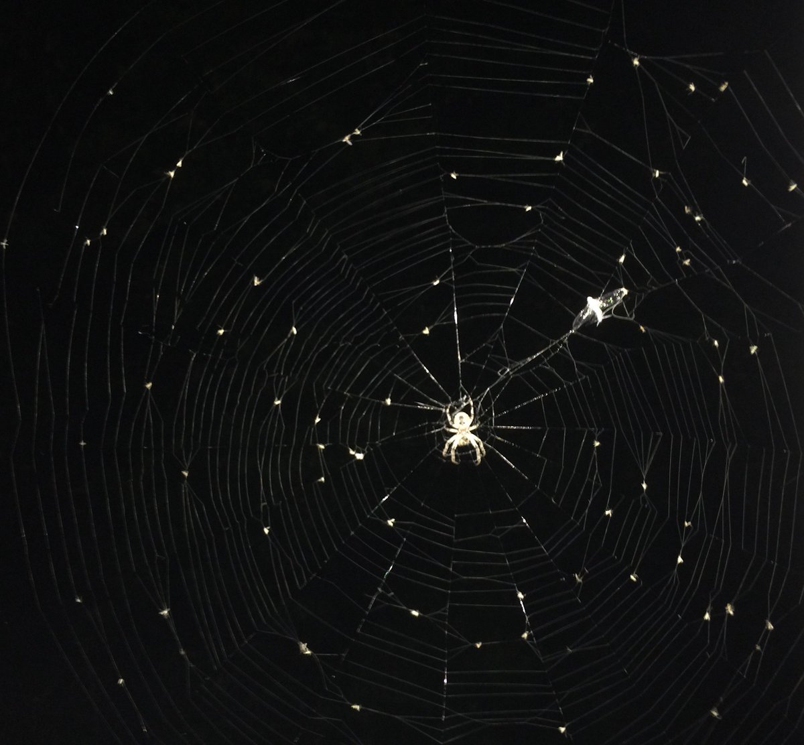

# Anansi

Repositorio del sistema de detección de patrones en cumulos estelares. Tesis de Doctorado

## Resumen: 

El presente trabajo explorará las caracterı́sticas más destacadas que debe reunir una base de datos de grafos para la implementación de un sistema de reconocimiento de patrones estructurales en cúmulos estelares cercanos. 

Se analizarán los parámetros a almacenar, de acuerdo a la información relevada por diversos proyectos de observación astronómica, ası́ como el modelo de representación más prometedor, considerando la finalidad del almacenamiento. 

Se describirán también algunas de las caracterı́sticas de bases de datos existentes, ası́ como sus ventajas y desventajas a la hora de implementar el mencionado sistema de reconocimiento. 

Se demostrará que una representación en forma de grafos de la información existente en los repositorios astronómicos no sólo es posible y puede ayudar al procesamiento automático de dicha información sino que además puede proveer un mecanismo efectivo para la implementación de algoritmos de reconocimiento de patrones y la consecuente detección de estructuras estelares de interés.

## Objetivos
### Objetivo general: 

### Objetivos particulares:

# Nerd Note

**Anansi** es un personaje popular africano. A veces toma la forma de una araña y es considerado el espíritu de todo el conocimiento de las historias.

